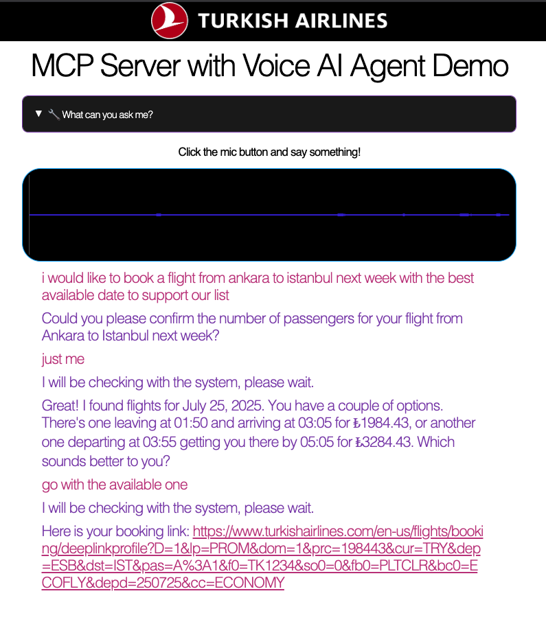

# Turkish Airlines Voice AI Assistant Demo

## What is this?

A real-time voice AI assistant that connects to Turkish Airlines services through voice interaction. Users can speak to ask about flights, bookings, and travel information, and get spoken responses back.

## Interface



## Motivation

Turkish Airlines has introduced their own [Model Context Protocol (MCP) server](https://mcp.turkishtechlab.com/) that provides AI assistants with access to flight information, booking details, and travel services. This project connects that MCP server with a voice AI agent to create a natural conversational experience.

**The Goal**: Transform Turkish Airlines' MCP tools from text-based interactions into natural voice conversations. Instead of typing queries, users can simply speak to:

- Check flight statuses and search flights
- Manage bookings and check-in information
- Access Miles&Smiles member services
- Get travel guides and promotions

**Key Technologies:**

- **LangChain**: For AI agent orchestration and MCP integration
- **Deepgram**: For speech-to-text (STT) and text-to-speech (TTS)
- **Turkish Airlines MCP**: For accessing real-time airline services and data

This demonstrates how MCP servers can be enhanced with voice interfaces to create more intuitive AI assistants for complex business workflows.

## Why is it important?

This demonstrates how to build conversational AI that can:

- Handle complex airline queries through voice
- Connect AI to real airline systems via MCP (Model Context Protocol)
- Provide natural voice interactions for travel services

## Data Flow

1. **User speaks** → Deepgram converts speech to text
2. **AI processes** → GPT-4 understands the request
3. **System calls** → MCP connects to Turkish Airlines services if needed
4. **Response generated** → AI creates helpful answer
5. **User hears** → Deepgram converts text back to speech

## Installation

### Requirements

- Python 3.8+

### Setup

1. **Clone and install dependencies:**

```bash
git clone <repository-url>
cd thy-mcp-voiceai-test
pip install -r requirements.txt
```

2. **Create `.env` file:**

```env
DEEPGRAM_API_KEY=your_deepgram_api_key_here
OPENAI_API_KEY=your_openrouter_api_key_here
PORT=3000
```

3. **Run the server:**

```bash
python server.py
```

4. **Open browser:** http://localhost:3000

Click the microphone button and start talking to the AI about Turkish Airlines services!
